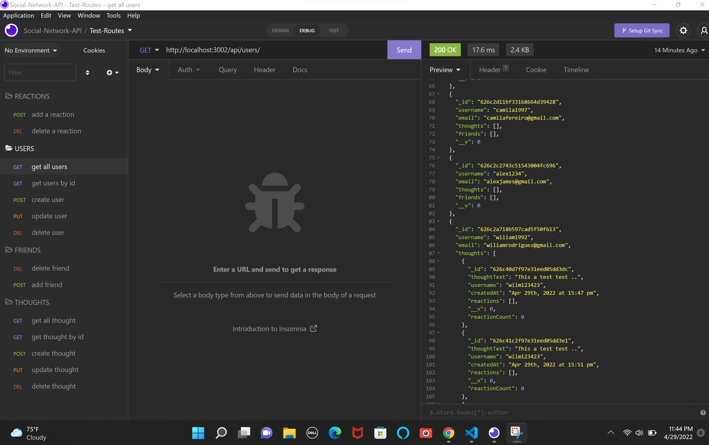

# Social Network API

## Table of Contents
- [Description](#description)
- [Installation](#installation)
- [Usage](#usage)
- [Contribution](#contribution)
- [Testing](#testing)
- [Screenshot](#screenshot)

## Description:
Project based on creating the back end project for an social media back end-API and how you be able to modified by adding routes, updating deleting it and creating, also the users can share their thoughts, and are able to react to friend's thoughts, we insomnia to test the routes, also we use  express and the main important library mongoose to make the app run

## Installation:
We are going to used npm install in the terminal  to install all the packages needed.

## Usage:
We used the project by cloning the repo and and start the project by installing the dependencies using npm i, and then your going to go to the terminal and do a npm start  to display the server.

## License:
This license is public used you can find it on:
https://opensource.org/licenses/MIT

## Contribution:
Yes you can contribute to the project by sending me  an email.

## Testing:
You can test the project by cloning the repository and start the project by installing the dependencies using npm i, and the next step your going to go the terminal and type npm start to run the project.

## Screenshot:

#### Walkthrough

[Intro video 🧑‍💻 ](https://drive.google.com/file/d/1TkESQWRsz-jx64ZXZIMPd2yFzGhZoMcP/view)

[Insomnia video-2🧑‍💻 ](https://drive.google.com/file/d/1sOsAQ667gw-XSZgtDrXdz1a8_-N0hhVH/view)

[Insomnia video-3🧑‍💻 ](https://drive.google.com/file/d/1wa5FEfiw7Bs7lydpBvZiWbdSQap2tyFC/view)

[Insomnia video-4🧑‍💻 ](https://drive.google.com/file/d/1yJHQradYJM-QuxgM_9mCYXxgCjkUJ-rf/view)

[Insomnia video-5🧑‍💻 ](https://drive.google.com/file/d/1YBN8iraTQjVZQNuk7XLGq8G7EOs-CaI9/view)

## Contact Information:
- Github: https://github.com/wilmerojeda13.
- Email: ojedawilmerantonio@gmail.com. 